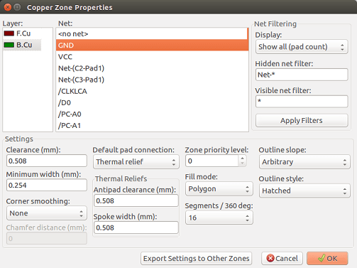
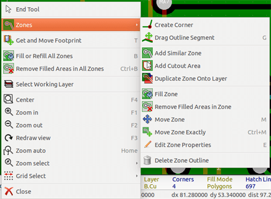
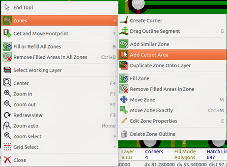
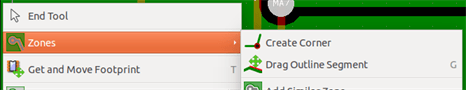
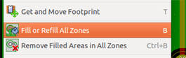
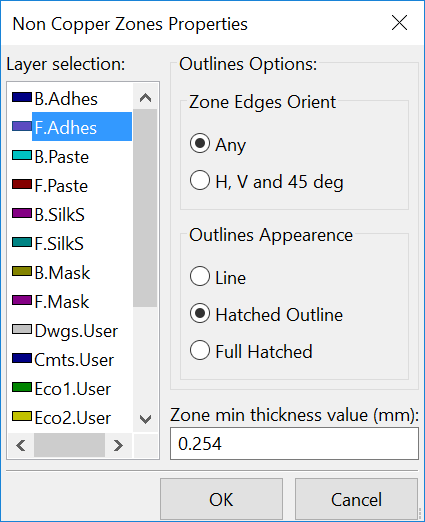
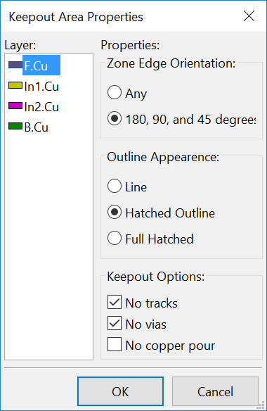

== Creating copper zones

Copper zones are defined by an outline (closed polygon), and can
include holes (closed polygons inside the outline). A zone can be
drawn on a copper layer or alternatively on a technical layer.

=== Creating zones on copper layers

Pad (and track) connections to filled copper areas are checked by
the DRC engine. A zone must be filled (not just created) to connect
pads. Pcbnew currently uses track segments or polygons to fill
copper areas.

Each option has its advantages and its disadvantages, the main disadvantage being increased
screen redraw time on slower machines. The final result is however the same.

For calculation time reasons, the zone filling is not recreated after
each change, but only:

* If a filling zone command is executed.

* When a DRC test is performed.

Copper zones must be filled or refilled after changes in tracks or
pads are made. Copper zones (usually ground and power planes) are usually
attached to a net.

In order to create a copper zone you should:

* Select parameters (net name, layer...).  Turning on the layer
  and highlighting this net is not mandatory but it is good practice.

* Create the zone limit (If not, the entire board will be filled.).

* Fill the zone.

Pcbnew tries to fill all zones in one piece, and usually, there will
be no unconnected copper blocks. It can happen that some areas
remain unfilled. Zones having no net are not cleaned and can have
insulated areas.

=== Creating a zone

==== Creating the limits of a zone

Use the tool image:images/icons/add_zone.png[]. The active layer
must be a copper layer. When clicking to start the zone outline, the
following dialog box will be opened.

You can specify all parameters for this zone:

* Net

* Layer

* Filling options

* Pad options

* Priority level

Draw the zone limit on this layer. This zone limit is a polygon,
created by left-clicking at each corner. A double-click will end
and close the polygon. If the starting point and
ending point are not at the same coordinate, Pcbnew will add a
segment from the end point to the start point.

[NOTE]
====
* The DRC control is active when creating zone outlines.
* A corner which creates a DRC error will not be accepted by Pcbnew.
====

In the following image you can see an example of a zone limit (polygon in thin
hatched line):

image::images/Pcbnew_zone_limit_example.png[scaledwidth="70%"]

==== Priority level

Sometimes a small zone must be created inside a large zone.

This is possible if the small zone has a higher priority level than
the large zone.

Level setting:

image::images/Pcbnew_zone_priority_level_setting.png[scaledwidth="35%"]

Here is an example:

image::images/Pcbnew_zone_priority_example.png[scaledwidth="70%"]

After filling:

image::images/Pcbnew_zone_priority_example_after_filling.png[scaledwidth="70%"]

==== Filling the zone

When filling a zone, Pcbnew removes all unconnected copper islands.
To access the zone filling command, right-click on the edge zone.

Activate the "Fill Zone" command. Below is the filling result
for a starting point inside the polygon:

image::images/Pcbnew_zone_filling_result.png[scaledwidth="70%"]

The polygon is the border of the filling area. You can see a
non-filled area inside the zone, because this area is not accessible:

* A track creates a border, and
* There is no starting point for filling in this area.

NOTE: You can use many polygons to create cutout areas. Here you can
see an example:

image::images/Pcbnew_zone_filled_with_cutout.png[scaledwidth="70%"]

=== Filling options

image::images/Pcbnew_zone_filling_options.png[scaledwidth="80%"]

When you fill an area, you must choose:

* The mode for filling.
* The clearance and minimum copper thickness.
* How pads are drawn inside the zone (or connected to this zone).
* Thermal relief parameters.

==== Filling mode

Zones can be filled using polygons or segments. The result is the
same. If you have problems with polygon mode (slow screen refresh)
you should use segments.

==== Clearance and minimum copper thickness

A good choice for clearance is a grid that is a bit bigger than the
routing grid. Minimum copper thickness value ensures that there are
no too small copper ares.

WARNING: if this value is too large, small shapes like thermal stubs
in thermal reliefs cannot be drawn.

==== Pad options

Pads of the net can either be included or excluded from the zone, or
connected by thermal reliefs.

* If included, soldering and un-soldering can be very difficult due
  to the high thermal mass of the large copper area.

image::images/Pcbnew_zone_include_pads.png[scaledwidth="50%"]

* If excluded, the connection to the zone will not be very good.

** The zone can be filled only if tracks exists to connect zone areas.

** Pads must be connected by tracks.

image::images/Pcbnew_zone_exclude_pads.png[scaledwidth="50%"]

* A thermal relief is a good compromise.

** Pad is connected by 4 track segments.

** The segment width is the current value used for the track width.

image::images/Pcbnew_zone_thermal_relief.png[scaledwidth="50%"]

==== Thermal relief parameters

image::images/Pcbnew_thermal_relief_settings.png[scaledwidth="30%"]

You can set two parameters for thermal reliefs:

image::images/Pcbnew_thermal_relief_parameters.png[scaledwidth="55%"]

==== Choice of parameters

The copper width value for thermal reliefs must be bigger than the
minimum thickness value for the copper zone. If not, they cannot be drawn.

Additionally, a too large value for this parameter or for antipad
size does not allow one to create a thermal relief for small pads (like
pad sizes used for SMD components).

=== Adding a cutout area inside a zone

A zone must already exist. To add a cutout area (a non-filled area
inside the zone):

* Right-click on an existing edge outline.
* Select Add Cutout Area.

* Create the new outline.

image::images/Pcbnew_zone_unfilled_cutout_outline.png[scaledwidth="50%"]

=== Outlines editing

An outline can be modified by:

* Moving a corner or an edge.
* Deleting or adding a corner.
* Adding a similar zone, or a cutout area.

If polygons are overlapping they will be combined.

To do that, right-click on a corner or on an edge, then select the
proper command.

Here is a corner (from a cutout) that has been moved:

image::images/Pcbnew_zone_corner_move_during.png[scaledwidth="70%"]

Here is the final result:

image::images/Pcbnew_zone_corner_move_after.png[scaledwidth="50%"]

Polygons are combined.

==== Adding a similar zone

Adding the similar zone:

image::images/Pcbnew_zone_add_similar_during.png[scaledwidth="50%"]

Final result:

image::images/Pcbnew_zone_add_similar_after.png[scaledwidth="50%"]

=== Editing zone parameters

When right-clicking on an outline, and using 'Edit Zone Params' the Zone params Dialog box will open. Initial parameters can be inputted . If the zone is already filled, refilling it will be necessary.

=== Final zone filling

When the board is finished, one must fill or refill all zones. To do
this:

* Activate the tool zones via the button image:images/icons/add_zone.png[].
* Right-click to display the pop-up menu.
* Use Fill or Refill All Zones: 

WARNING: Calculation can take some time if the filling grid is small.

=== Change zones net names

After editing a schematic, you can change the name of any net. For
instance VCC can be changed to +5V.

When a global DRC control is made Pcbnew checks if the zone net name
exists, and displays an error if not.

Manually editing the zone parameters will be necessary to change the old
name to the new one.

=== Creating zones on technical layers

==== Creating zone limits

This is done using the button image:images/icons/add_zone.png[]. The active layer must be a technical
layer.

When clicking to start the zone outline, this dialog box is opened:

Select the technical layer to place the zone and draw the zone
outline like explained previously for copper layers.

[NOTE]
====
* For editing outlines use the same method as for copper zones.
* If necessary, cutout areas can be added.
====

=== Creating a Keepout area

Select the tool 

The active layer should be a copper layer.

After clicking on the starting point of a new keepout area, the dialog
box is opened:

One can select disallowed items:

* Tracks.
* Vias.
* Copper pours.

When a track or a via is inside a keepout which does not allow it, a
DRC error will be raised.

For copper zones, the area inside a keepout with no copper pour will
be not filled. A keep-out area is a like a zone, so editing its
outline is analogous to copper zone editing.
