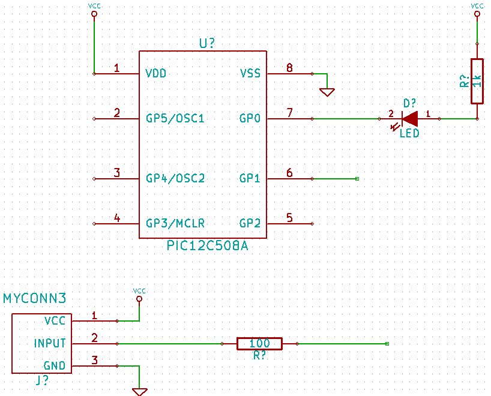
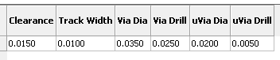
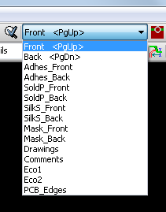
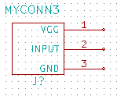
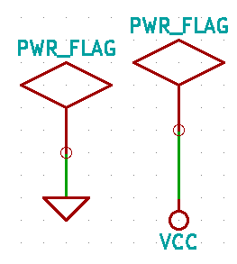
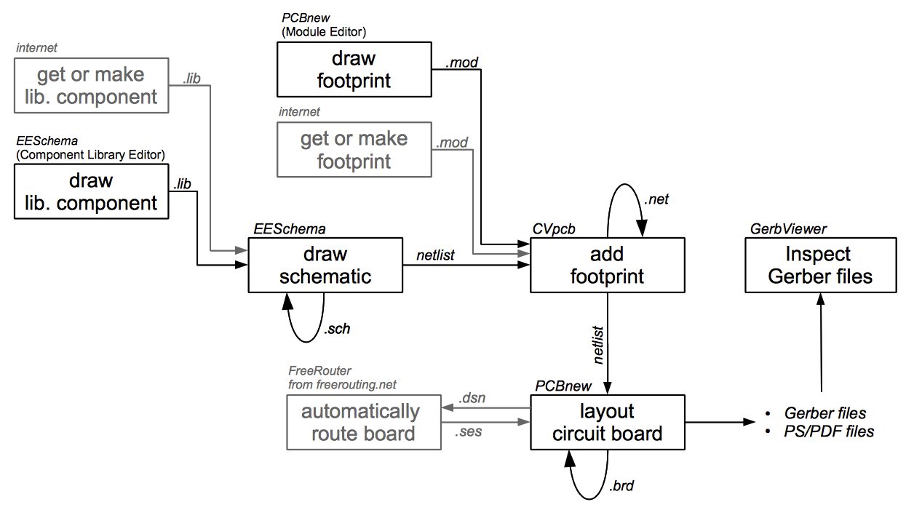
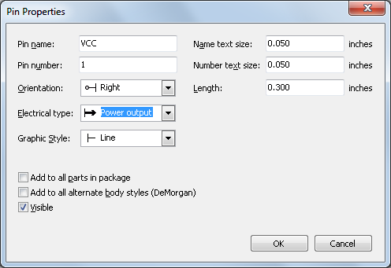
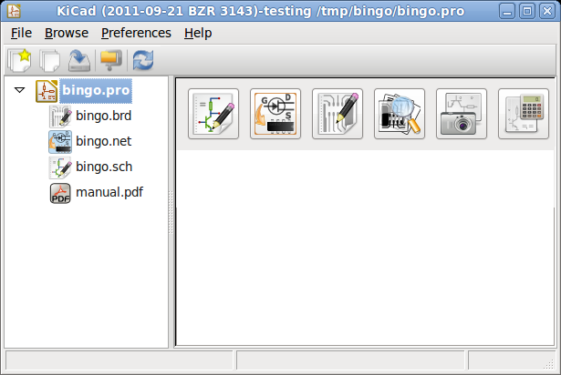
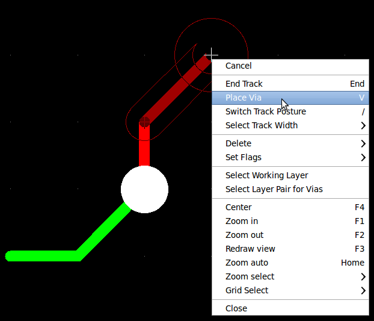
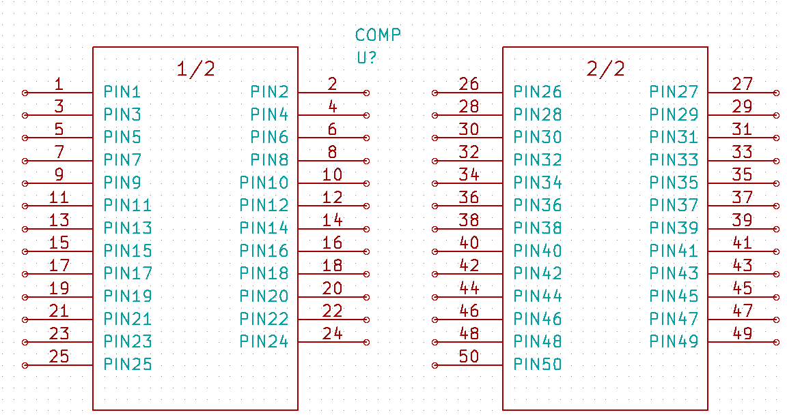

Getting Started in Kicad
========================

*Essential and concise guide to mastering KiCad for the successful
development of sophisticated electronic printed circuit boards.*

**Copyright**

This document is Copyright © 2010–2011 by its contributors as listed
below. You may distribute it and/or modify it under the terms of either
the GNU General Public License ( `http://www.gnu.org/licenses/gpl.html
<http://www.gnu.org/licenses/gpl.html>`_ ), version 3 or later, or the
Creative Commons Attribution License (
`http://creativecommons.org/licenses/by/3.0/
<http://creativecommons.org/licenses/by/3.0/>`_ ), version 3.0 or later.

All trademarks within this guide belong to their legitimate owners.

**Contributors**

David Jahshan, Phil Hutchinson, Fabrizio Tappero, Christina Jarron.

**Feedback**

Please direct any comments or suggestions about this document to:

Fabrizio Tappero: fabrizio.tappero<at>gmail.com or David Jahshan:
kicad<at>iridec.com.au

Alternatively, submit comments or your new version to:

..
    no more active:
    http://kicad.sourceforge.net/wiki/Main_Page

https://launchpad.net/~kicad-developers

**Acknowledgments**

None

**Publication date and software version**

Published on September 27, 2011 Based on LibreOffice 3.3.2.

**Note for Mac users**

The KiCad support for the Apple OS X operating system is experimental.

.. toctree::

Introduction to KiCad
=====================

KiCad is an open-source software tool for the creation of electronic
schematic diagrams and PCB artwork. Beneath its singular surface, KiCad
incorporates an elegant ensemble of the following stand-alone software
tools:

================ ===========================
KiCad            project manager
EESchema         schematic editor
CVpcb            footprint selector
PCBnew           circuit board layout editor
GerbView         Gerber viewer
Bitmap2Component component maker
================ ===========================

At the time of writing, KiCad can be considered mature enough to be used
for the successful development and maintenance of complex electronic
boards. KiCad does not present any board-size limitation and it can
easily handle up to 16 copper layers and up to 12 technical layers. KiCad
can create all the files necessary for building printed boards, Gerber
files for photo-plotters, drilling files, component location files and a
lot more.

Being open source (GPL licensed), KiCad represents the ideal tool for
projects oriented towards the creation of electronic hardware with an
open-source flavour.

On the Internet, the home of KiCad is:

..
    no more active:
    http://kicad.sourceforge.net/wiki/Main_Page

http://iut-tice.ujf-grenoble.fr/kicad/index.html

http://www.gipsa-lab.inpg.fr/realise_au_lis/kicad/index.html

Download and install KiCad
--------------------------

KiCad runs on Linux, Apple OS X and Windows. You can download a copy of
KiCad from:

..
    no more active:
    http://kicad.sourceforge.net/wiki/Main_Page

Installation instructions are available on the KiCad website under:
*Infos/Install*.

**Whatever installation method you choose, always go for a recent version
of KiCad.**

Under Linux
-----------

Under Linux, the easiest way to install KiCad is via
*Aptitude*. Type into your Terminal:

 sudo add-apt-repository ppa:paxer/ppa

 sudo aptitude update && sudo aptitude safe-upgrade

 sudo aptitude install kicad kicad-doc-en

At the time of writing, the standard *apt-get* repository of Ubuntu
offers a version of KiCad that is about one year old.

Alternatively, you can download and install a pre-compile version of
KiCad, or directly download the source code, compile and install KiCad.

Under Apple OS X
----------------

At the time of writing, the best way to install KiCad on Apple OS X is to
download a pre-build binary from:

..
    no more active:
    http://kicad.sourceforge.net/wiki/Download

KiCad work-flow
===============

Despite its similarities with other PCB software tools, KiCad is
characterised by an interesting work-flow in which schematic components
and footprints are actually two separate entities. This is often the
subject of discussion on Internet forums.

The KiCad work-flow is comprised of two main tasks: making the schematic
and laying out the board. Both a components library and a footprints
library are necessary for these two tasks. KiCad has plenty of both. Just
in case that is not enough, KiCad also has the tools necessary to make
new ones.

|10000000000004DD000002BDCE77181D_png|

In the picture above, the greyed out blocks indicate component-drawing
and footprint-drawing tools that are not strictly part of KiCad. However,
since they are all very valuable options, do not forget to check them
out. You can find some at this address:

http://kicad.rohrbacher.net/quicklib.php

On this site, you will find an example of a tool that allows you to
quickly create a KiCad library component. For more information about
quicklib, refer to the section of this document titled
*Make Schematic Component With quicklib*.

Forward and backward annotation
-------------------------------

Once an electronic schematic has been fully drawn, the next step is to
transfer it to a PCB following the KiCad work-flow. Once the board layout
process has been partially or completely done, additional components or
nets might need to be added, parts moved around and much more. This can
be done in two ways: Backward Annotation and Forward Annotation.

Backward Annotation is the process of sending a PCB layout change back to
its corresponding schematic. Some do not consider this particular feature
especially useful.

Forward Annotation is the process of sending schematic changes to a
corresponding PCB layout. This is a fundamental feature because you do
not really want to re-do the layout of the whole PCB every time you make
a modification to your schematic. Forward Annotation is discussed in the
section titled *Forward Annotation*.

Draw electronic schematics
==========================

In this section we are going to learn how to draw an electronic schematic
using KiCad.

#.  Under Windows run kicad.exe. Under Linux type kicad in your Terminal.
    You are now in the main window of the KiCad project manager. From
    here you have access to five stand-alone software tools: *EESchema*,
    *Cvpcb*, *PCBnew*, *GerbView* and *Bitmap2Component*. Refer to the
    work-flow chart for an idea of what all these tools are used for.

    |kicad_main_window_png|

#.  Create a new project: **File** -> **New**. Click on the 'New Folder'
    button, and give your new folder the same name as your project:
    'tute1'. Open the new folder by double clicking on it. All your
    project files will be saved here. Name the project file 'tute1'. The
    project file will automatically take the extension .pro.

#.  Let's begin by creating a schematic. Start the schematic editor
    *EESchema*, |eeschema_png|. It is the first button from the left. If
    an error dialogue appears telling you that a project file was not
    found, ignore it and click OK.

#.  First thing, save the whole schematic project: **File** -> **Save
    Whole Schematic Project**. Click on the 'Page Settings' icon
    |sheetset_png| on the top toolbar. Set the Page Size as 'A4' and
    enter the Title as 'Tute 1'. You will see that more information can
    be entered here if necessary. Click OK. This information will
    populate the schematic sheet at the bottom right corner. Use the
    mouse wheel to zoom in.

#.  We will now place our first component. Click on the 'Add components'
    icon |100002010000001A0000001ACFBFFF00_png| in the right toolbar. The
    same functionality is achieved by pressing the 'Add components'
    shortcut a key.

    NOTE: You can see a list of all available shortcut keys by pressing
    the ? key. Click in the middle of your schematic sheet to place your
    first component. The Component Selection window will appear. Click on
    the 'List All' button. The Select Library window will appear. Here
    you have a list of all available libraries.

#.  Select the 'device' library by double clicking on it. The Select
    Component window will appear. Here you have a list of components
    belonging to the 'device' library, which is a quite generic and
    useful library.

#.  Scroll down and double click on the resistor 'R'. This will close the
    'Select Component' window and take you back to your schematic sheet.

#.  Place the component in the schematic sheet by clicking where you want
    it to be. Click on the magnifier to zoom in on the component.
    Alternatively, use the mouse wheel to zoom in and zoom out.
    Unfortunately, the panning option has not yet been implemented.

#.  Hover the mouse over the component 'R' and press the r key. Notice
    how the component rotates.

    NOTE: You do not need to actually click on the component to rotate
    it.

#.  Right click in the middle of the component and select **Edit
    Component** -> **Value**. You can achieve the same result by hovering
    over the component and pressing the v key. Alternatively, the e key
    will take you to the more general Edit window. Notice how the
    right-click window below shows all possible shortcut keys for all
    available actions.

    |100000000000026B000001BD635CBA2F_png|

#.  The Component value window will appear. Replace the current value 'R'
    with '1k'. Click OK.

    NOTE: Do not change the Reference field (R?), this will be done
    automatically later on. The value inside the resistor should now be
    '1k'.

    |10000000000000B0000000463CCB103A_png|

#.  To place another resistor, simply click where you want the resistor
    to appear. The Component Selection window will appear again.

#.  The resistor you previously chose is now in your history list,
    appearing as 'R'. Click OK and place the component.

    |100000000000016C000000E147EEA45E_png|

#.  In case you make a mistake and want to delete a component, right
    click on the component and click 'Delete Component'. This will remove
    the component from the schematic. Alternatively, you can hover over
    the component you want to delete and press the del key.

    NOTE: You can rename any default shortcut key by going to
    **Preferences** -> **Hotkeys**. Do not forget to save the new keys with
    **Preferences** -> **Save preferences**.

#.  You can also duplicate a component already on your schematic sheet by
    hovering over it and pressing the c key. Click where you want to
    place the new duplicated component.

#.  Right click on the second resistor. Select 'Drag Component'.
    Reposition the component and left click to drop. The same
    functionality can be achieved by hovering over the component and by
    pressing the g key. Use the r key to rotate the component. The x key
    and the y key will flip the component.

    NOTE: **Right-Click** -> **Move component** (equivalent to the m key
    option) is also a valuable option for moving anything around, but it
    is better to use this only for component labels and components yet to
    be connected. We will see later on why this is the case.

#.  Edit the second resistor by hovering over it and pressing the v key.
    Replace 'R' with '100'. You can undo any of your editing actions with
    the ctrl+z key.

#.  Change the grid size. You have probably noticed that on the schematic
    sheet all components are snapped onto a large pitch grid. You can
    easily change the size of the grid by **Right-Click** -> **Grid
    select**. *In general, it is recommendable to use a grid of 25.0 mils
    for the schematic sheet*.

#.  Repeat the add-component steps, however this time select the
    'microcontrollers' library instead of the 'device' library and pick
    the 'PIC12C508A' component instead of the 'R' component from it.

#.  Hover the mouse over the microcontroller component. Press the y key
    or the x key on the keyboard. Notice how the component is flipped
    over its x axis or its y axis. Press the key again to return it to
    its original orientation.

#.  Repeat the add-component steps, this time choosing the 'device'
    library and picking the 'LED' component from it.

#.  Organise all components on your schematic sheet as shown below.

    |1000000000000279000001D2A3715F27_png|

#.  We now need to create the schematic component 'MYCONN3' for our 3-pin
    connector. You can jump to the section titled *Make a Schematic
    Component in KiCad* to learn how to make this component from scratch
    and then return to this section to continue with the board.

    -> *jump to the section: Make a Schematic Component in KiCad*

#.  You can now place the freshly made component. Press the a key and
    select 'List All'. Choose the library 'myLib' and pick the component
    'MYCONN3'.

#.  The component identifier 'J?' will appear under the 'MYCONN3' label.
    If you want to change its position, right click on 'J?' and click on
    'Move Field' (equivalent to the m key option). It might be helpful to
    zoom in before/while doing this. Reposition 'J?' under the component
    as shown below. Labels can be moved around as many times as you
    please.

    |10000000000000950000007B843ADE6A_png|

#.  It is time to place the power and ground symbols. Click on the 'Place
    a power port' button |add_power_png| on the right toolbar.
    Alternatively, press the a key and choose the 'power' library. In the
    component selection window, click on the 'List All' button. Scroll
    down and select 'VCC' from the Select Component window. Click OK.

#.  Click above the pin of the 1k resistor to place the VCC part. Click
    on the area above the microcontroller 'VDD'. In the 'Component
    Selection history' section select 'VCC' and place it next to the VDD
    pin. Repeat the add process again and place a VCC part above the VCC
    pin of 'MYCONN3'.

#.  Repeat the add-pin steps but this time select the GND part. Place a
    GND part under the GND pin of 'MYCONN3'. Place another GND symbol on
    the right of the VSS pin of the microcontroller. Your schematic
    should now look something like this:

    |1000000000000303000002A0130916D9_png|

#.  Next, we will wire all our components. Click on the 'Place a wire'
    icon |100002010000001A0000001A10CC204F_png| on the right toolbar.
    **NOTE**: Be careful not to pick 'Place a bus', which appears
    directly beneath this button but has thicker lines. The section *Bus
    Connections in KiCad* will explain how to use a bus section.

#.  Click on the little circle at the end of pin 7 of the microcontroller
    and then click on the little circle on pin 2 of the LED. You can zoom
    in while you are placing the connection.

    NOTE: If you want to reposition wired components, it is important to
    use the g key (grab) option and not the m key (move) option. Using
    the grab option will keep the wires connected. Review step 24 in case
    you have forgotten how to move a component. 

    |1000000000000134000000D9A9B4ED54_png|

#.  Repeat this process and wire up all the other components as shown
    below. To terminate a wire just double-click. When wiring up the VCC
    and GND symbols, the wire should touch the bottom of the VCC symbol
    and the middle top of the GND symbol. See the screenshot below.

    |100000000000033200000294961F4BAD_png|

#.  We will now consider an alternative way of making a connection using
    labels. Pick a net labelling tool by clicking on the 'Place net name'
    icon |label_png| on the right toolbar. You can also use the l key.

#.  Click in the middle of the wire connected to pin 6 of the
    microcontroller. Name this label 'INPUT'.

#.  Follow the same procedure and place another label on line on the
    right of the 100 ohm resistor. Also name it 'INPUT'. The two labels,
    having the same name, create an invisible connection between pin 6 of
    the PIC and the 100 ohm resistor. This is a useful technique when
    connecting wires in a complex design where drawing the lines would
    make the whole schematic messier. To place a label you do not
    necessarily need a wire, you can simply attach the label to a pin.

#.  Labels can also be used to simply label wires for informative
    purposes. Place a label on pin 7 of the PIC. Enter the name
    'uCtoLED'. Name the wire between the resistor and the LED as
    'LEDtoR'. Name the wire between 'MYCONN3' and the resistor as
    'INPUTtoR'.

#.  You do not have to label the VCC and GND lines because the labels are
    implied from the power objects they are connected to.

#.  Below you can see what the final result should look like.

    |1000000000000340000002A2DDE0F6DA_png|

#.  Let's now deal with unconnected wires. Any pin or wire that is not
    connected will generate a warning when checked by KiCad. To avoid
    these warnings you can either instruct the program that the
    unconnected wires are deliberate or manually flag each unconnected
    wire or pin as unconnected.

#.  Click on the 'Place no connect flag' icon |noconn_png| on the right
    toolbar. Click on pins 2, 3, 4 and 5. An X will appear to signify
    that the lack of a wire connection is intentional.

    |10000000000001C8000000FEEDCB5FB8_png|

#.  Some components have power pins that are invisible. You can make them
    visible by clicking on the 'Show hidden pins' icon |hidden_pin_png|
    on the left toolbar. Hidden power pins get automatically connected if
    VCC and GNS naming is respected. Generally speaking, you should try
    not to make hidden power pins.

#.  It is now necessary to add a 'Power Flag' to indicate to KiCad that
    power comes in from somewhere. Press the a key, select 'List All',
    double click on the 'power' library and search for 'PWR_FLAG'. Place
    two of them. Connect them to a GND pin and to VCC as shown below.

    |100000000000010700000125A4376EBB_png|

    NOTE: This will avoid the classic schematic checking warning:
    Warning Pin power_in not driven (Net xx)

#.  Sometimes it is good to write comments here and there. To add
    comments on the schematic use the 'Place graphic text (comment)' icon
    |add_text_png| on the right toolbar.

#.  All components now need to have unique identifiers. In fact, many of
    our components are still named 'R?' or 'J?'. Identifier assignation
    can be done automatically by clicking on the 'Annotate schematic'
    icon |annotate_png|.

#.  In the Annotate Schematic window, select 'Use the entire schematic'
    and click on the 'Annotation' button. Click OK in the confirmation
    message and then click 'Close'. Notice how all the '?' have been replaced
    with numbers. Each identifier is now unique. In our example, they have
    been named 'R1', 'R2', 'U1', 'D1' and 'J1'.

#.  We will now check our schematic for errors. Click on the 'Perform
    Electric Rules Check' icon |erc_png|. Click on the 'Test ERC' button.
    A report informing you of any errors or warnings such as disconnected
    wires is generated. You should have 0 Errors and 0 Warnings. In case
    of errors or warnings, a small green arrow will appear on the
    schematic in the position where the error or the warning is located.
    Check 'Write ERC report' and press the 'Test ERC' button again to
    receive more information about the errors.

#.  The schematic is now finished. We can now create a Netlist file to
    which we will add the footprint of each component. Click on the
    'Netlist generation' icon |netlist_png| on the top toolbar. Click on
    'Netlist' then click on 'save'. Save under the default file name.

#.  You can now quit the schematic editor. From KiCad, click on the 'Run
    Cvpcb' icon |icon_cvpcb_small_png| on the top toolbar. If a missing
    file error window pops up, just ignore it and click OK.

#.  *Cvpcb* allows you to link all the components in your schematic with
    footprints in the KiCad library. The pane on the left shows all the
    components used in your schematic. Here select 'D1'. In the pane on
    the right you have all the available footprints, here scroll down to
    'LEDV' and double click on it. |cvpcb_png|

#.  It is possible that the pane on the right shows only a selected
    subgroup of available footprints. This is because KiCad is trying to
    suggest to you a subset of suitable footprints. Click on the icon
    |module_full_list_png| to deselect this filter.

#.  For 'J1' select the '3PIN_6mm' footprint. For 'R1' and 'R2' select
    the 'R1' footprint. Select 'DIP-8_300' for 'U1'.

#.  If you are interested in knowing what the footprint you are choosing
    looks like, you have two options. You can click on the 'View selected
    footprint' icon |show_footprint_png| for a preview of the current
    footprint. Alternatively, click on the 'Display footprint list
    documentation' icon |datasheet_png| and you will get a multi-page PDF
    document with all available footprints. You can print it out and
    check your components to make sure that the dimensions match.

#.  You are done. You can now update your netlist file with all the
    associated footprints. Click on **File** -> **Save As**. The default
    name 'tute1.net' is fine, click save. Otherwise you can use the icon
    |100002010000001A0000001AF4CF46A1_png|. Your netlist file has now
    been updated with all the footprints. Note that if you are missing
    the footprint of any device, you will need to make your own
    footprints. This will be explained in a later section of this
    document.

#.  You can close *Cvpcb* and go back to the *EESchema* schematic
    editor. Save the project by clicking on **File** -> **Save Whole
    Schematic Project**. Close the schematic editor.

#.  Switch to the KiCad project manager.

#.  The netlist file describes all components and their respective pin
    connections. The netlist file is actually a text file that you can
    easily inspect, edit or script.

    NOTE: Library files (*\*.lib*) are text files too and they are also
    easily editable or scriptable.

#.  To create a bill of materials, go to the *EESchema* schematic editor
    and click on the 'Bill of materials' icon |bom_png| on the top
    toolbar.

#.  Click OK and then 'Save'. You can inspect the bill of materials with
    any text editor.

You are now ready to move to the PCB layout part, which is presented in
the next section. However, before moving on let's take a quick look at
how to connect component pins using a bus line.

Bus connections in KiCad
------------------------

Sometimes you might need to connect several sequential pins of component
A with some other sequential pins of component B. In this case you have
two options: the labelling method we already saw or the use of a bus
connection. Let's see how to do it.

#.  Let us suppose that you have three 4-pin connectors that you want to
    connect together pin to pin. Use the label option (press the l key)
    to label pin 4 of the P4 part. Name this label 'a1'. Now let's press
    the Ins key to have the same action automatically performed on the
    pin below pin 4 (PIN 3). Notice how the label is automatically
    renamed 'a2'.

#.  Press the Ins Key two more times. The Ins key corresponds to the
    action 'Repeat last action' and it is an infinitely useful command
    that can make your life a lot easier.

#.  Repeat the same labelling action on the two other connectors CONN_2
    and CONN_3 and you are done. If you proceed and make a PCB you will
    see that the three connectors are connected to each other. Figure 2
    shows the result of what we described. For aesthetic purposes it is
    also possible to add a series of 'Wire to bus entry' using the icon
    |100000000000001C0000001CA8839A4E_png| and bus line using the icon
    |100000000000001C0000001C232C9272_png|, as shown in Figure 3. Mind,
    however, that there will be no effect on the PCB.

#.  It should be pointed out that the short wire attached to the pins in
    Figure 2 is not strictly necessary. In fact, the labels could have
    been applied directly to the pins.

#.  Let's take it one step further and suppose that you have a fourth
    connector named CONN_4 and, for whatever reason, its labelling
    happens to be a little different (b1, b2, b3, b4). Now we want to
    connect *Bus a* with *Bus b* in a pin to pin manner. We want to do
    that without using pin labelling (which is also possible) but by
    instead using labelling on the bus line, with one label per bus.

#.  Connect and label CONN_4 using the labelling method explained before.
    Name the pins b1, b2, b3 and b4. Connect the pin to a series of 'Wire
    to bus entry' using the icon |add_line2bus_png| and to a bus line
    using the icon |add_bus_png|. See Figure 4.

#.  Put a label (press the l key option) on the bus of CONN_4 and name it
    'b[1..4]'.

#.  Put a label (press the l key option) on the previous a bus and name
    it 'a[1..4]'.

#.  What we can now do is connect bus a[1..4] with bus b[1..4] using a 
    bus line with the button |add_bus_png|.

#.  By connecting the two buses together, pin a1 will be automatically
    connected to pin b1, a2 will be connected to b2 and so on. Figure 4
    shows what the final result looks like. NOTE: The 'Repeat last
    action' option accessible via the Ins key can be successfully used to
    repeat period actions. For instance, the short wires connected to all
    pins in Figure 2, Figure 3 and Figure 4 have been placed with this
    option. Learn how to use it because it will make using KiCad easier.

#.  The 'Repeat last action' option accessible via the Ins key has also
    been extensively used to place the many series of 'Wire to bus entry'
    using the icon |add_line2bus_png|.
    |10000000000004A2000001E05B3D8DFF_png|

Layout printed circuit boards
=============================

It is now time to use the netlist file you generated to lay out the PCB.
This is done with the *PCBnew* tool.

#.  From the KiCad project manager, click on the 'PCBNew' icon
    |pcbnew_png|. The 'PCBNew' window will open. If you get an error
    message saying that a *.brg* file does not exist just ignore it and
    click OK.

#.  Begin by entering some schematic information. Click on the 'Page
    settings' icon |sheetset_png| on the top toolbar. Set 'paper size' as
    'A4' and 'title' as 'Tute 1'.

#.  It is a good idea to start by setting the **clearance** and the
    **minimum track width** to those required by your PCB manufacturer.
    In general you can set the clearance to 0.015' and the minimum track
    width to 0.01'. Click on the **Design Rules** -> **Design Rules**
    menu. If it does not show already, click on the 'Net Classes Editor'
    tab. Change the 'Clearance' field at the top of the window to '0.015'
    and the 'Track Width' field to '0.01' as shown below. Measurements
    here are in inches.

    |10000000000001600000004C7BBE79B9_png|

#.  Click on the 'Global Design Rules' tab and set 'Min track width' to
    0.01'. Click the OK button to commit your changes and close the
    Design Rules Editor window.

#.  Now we will import the netlist file. Click on the 'Read Netlist' icon
    |netlist_png| on the top toolbar. Click on the 'Browse Netlist Files'
    button, select 'tute1.net' in the File selection dialogue, and click
    on 'Read Current Netlist'. Then click the 'Close' button.

#.  All components should now be visible in the top left hand corner just
    above the page. Scroll up if you cannot see them.

#.  Select all components with the mouse and move them to the middle of
    the board. If necessary you can zoom in and out while you move the
    components.

#.  All components are connected via a thin group of wires called
    *ratsnest*. Make sure that the 'Hide board ratsnest' button
    |general_ratsnest_png| is pressed. In this way you can see the
    ratsnest linking all components. NOTE: The tool-tip is backwards;
    pressing this button actually displays the ratsnest.

#.  You can move each component by hovering over it and pressing the g
    key. Click where you want to place them. Move all components around
    until you minimise the number of wire crossovers. NOTE: If instead of
    grabbing the components (with the g key ) you move them around using
    the m key you will later note that you lose the track connection (the
    same occurs in the schematic editor). Bottom line, always use the g
    key option. |10000000000001FD000001B15F2BA74A_png|

#.  If the ratsnest disappears or the screen gets messy, right click and
    click 'Redraw view'. Note how one pin of the 100 ohm resistor is
    connected to pin 6 of the PIC component. This is the result of the
    labelling method used to connect pins. Labels are often preferred to
    actual wires because they make the schematic much less messy.

#.  Now we will define the edge of the PCB. Select 'PCB Edges' from the
    drop down menu in the top toolbar. Click on the 'Add graphic line or
    polygon' icon |add_dashed_line_png| on the right toolbar. Trace
    around the edge of the board, clicking at each corner, and remember
    to leave a small gap between the edge of the green and the edge of
    the PCB.

#.  Next, connect up all the wires except GND. In fact, we will connect
    all GND connections in one go using a ground plane placed on the
    bottom copper (called *Back*) of the board.

#.  Now we must choose which copper layer we want to work on. Select
    'Front' in the drag down menu on the top toolbar. This is the top
    copper layer. |10000000000000D30000010D5271F1F8_png|

#.  If you decide, for instance, to do a 4 layer PCB instead, go to
    **Design Rules** -> **Layers Setup** and change 'Copper Layers' to 4.
    In the 'Layers' table you can name layers and decide what they can be
    used for. Notice that there are very useful presets that can be
    selected via the 'Preset Layers Groupings' menu.

#.  Click on the 'Add Tracks and vias' icon |add_tracks_png| on the right
    toolbar. Click on pin 1 of 'J1' and run a track to pad 'R2'.
    Double-click to set the point where the track will end. The width of
    this track will be the default 0.203 mm. You can change the track
    width from the drop-down menu in the top toolbar. Mind that by
    default you have only one track width available. |pcbnew_1_png|

#.  If you would like to add more track widths g o to: **Design Rules**
    -> **Design Rules** -> **Global Design Rules** tab and at the bottom 
    right of this window add any other width you would like to have
    available. You can then choose the widths of the track from the
    drop-down menu while you lay out your board. See the example below.
    |1000000000000169000001178613965A_png|

#.  Alternatively, you can add a Net Class in which you specify a set of
    options. Go to **Design Rules** -> **Design Rules** -> **Net Classes
    Editor** and add a new class called 'power'. Change the track width
    from 8 mil (indicated as 0.0080) to 24 mil (indicated as 0.0240).
    Next, add everything but ground to the ‘power’ class (select
    'default' at left and 'power' at right and use the arrows).

#.  If you want to change the grid size, **Right click** -> **Grid
    Select**. Be sure to select the appropriate grid size before or after
    laying down the components and connecting them together with tracks.

#.  Considering, for instance, that a 0.8mm BGA component has a pin to
    pin distance of about 30 mil (0.8mm), **it is generally commendable
    to set a grid size of 5 mil when you route**.

#.  Repeat this process until all wires, except pin 3 of J1, are
    connected. Your board should look like the example below.
    |10000000000001F8000001B32F1802F1_png|

#.  Let's now run a track on the other copper side of the PCB. Select
    'Back' in the drag down menu on the top toolbar. Click on the 'Add
    tracks and vias' icon |add_tracks_png|. Draw a track between pin 3 of
    J1 and pin 8 of U1. This is actually not necessary since we could do
    this with the ground plane. Notice how the colour of the track has
    changed.

#.  **Go from pin A to pin B by changing layer**. It is possible to
    change the copper plane while you are running a track by placing a
    via. While you are running a track on the upper copper plane, right
    click and select 'Place Via' or simply press the v key. This will
    take you to the bottom layer where you can complete your track.
    |100000000000026E000002155D41D893_png|

#.  When you want to inspect a particular connection you can click on the
    'Net highlight' icon |net_highlight_png| on the right toolbar. Click
    on pin 3 of J1. The track itself and all pads connected to it should
    become highlighted.

#.  Now we will make a ground plane that will be connected to all GND
    pins. Click on the 'Add Zones' icon |add_zone_png| on the right
    toolbar. We are going to trace a rectangle around the board, so click
    where you want one of the corners to be. In the dialogue that
    appears, set 'Pad in Zone' to 'Thermal relief' and 'Zone edges
    orient' to 'H,V' and click OK.

#.  Trace around the outline of the board by clicking each corner in
    rotation. Double-click to finish your rectangle. Right click inside
    the area you have just traced. Click on 'Fill or Refill All Zones'.
    The board should fill in with green and look something like this:
    |10000000000001830000015C1D559586_png|

#.  Run the design rules checker by clicking on the 'Perform Design Rules
    Check' icon |erc_png| on the top toolbar. Click on 'Start DRC'. There
    should be no errors. Click on 'List Unconnected'. There should be no
    unconnected track. Click OK to close the DRC Control dialogue.

#.  Save your file by clicking on **File** -> **Save**. To admire your
    board in 3D, click on **View** -> **3D Display**.

#.  You can drag your mouse around to rotate the PCB.

#.  Your board is complete. To send it off to a manufacturer you will
    need to generate all Gerber files.

Generate Gerber files
---------------------

Once your PCB is complete, you can generate Gerber files for each layer
and send them to your favourite PCB manufacturer, who will make the board
for you.

#.  From KiCad, open the *PCBNew* software tool and load your board file
    by clicking on the icon |open_document_png|.

#.  Click on **File** -> **Plot**. Select 'Gerber' as the 'Plot Format'
    and select the folder in which to put all Gerber files.

#.  These are the layers you need to select for making a typical 2-layer
    PCB:

+----------------------+----------------------+---------------------------+
| **KiCad Layer Name** | **What it is**       | **Gerber File Extension** |
+----------------------+----------------------+---------------------------+
| Copper               | Bottom Layer         | .GBL                      |
+----------------------+----------------------+---------------------------+
| Component            | Top Layer            | .GTL                      |
+----------------------+----------------------+---------------------------+
| SilkS_Cmp            | Top Overlay          | .GTO                      |
+----------------------+----------------------+---------------------------+
| Mask_Cop             | Bottom Solder Resist | .GBS                      |
+----------------------+----------------------+---------------------------+
| Mask_Cmp             | Top Solder Resist    | .GTS                      |
+----------------------+----------------------+---------------------------+
| Edges_Pcb            | Edges                | N/A                       |
+----------------------+----------------------+---------------------------+

#.  Proceed by clicking on the 'Plot' button. To view all your Gerber
    files go to the KiCad project manager and click on the 'GerbView'
    icon. On the drag down menu select 'Layer 1'. Click on **File** ->
    **Load Gerber file** or click on the icon |gerber_file_png|. Load all
    generated Gerber files one at a time. Note how they all get displayed
    one on top of the other.

#.  Use the menu on the right to select/deselect which layer to show.
    Carefully inspect each layer before sending them for production.

#.  To generate the drill file, from *PCBNew* go again for the **File**
    -> **Plot** option. Default settings should be fine.

Automatically route with FreeRouter
-----------------------------------

Routing a board by hand is quick and fun, however, for a board with lots
of components you might want to use an autorouter. Remember that you
should first route critical traces by hand and then set the autorouter to
do the boring bits. Its work will only account for the unrouted traces.
The autorouter we will use here is FreeRouter from
*freerouting.net*.

#.  From *PCBNew* click on **File** -> **Export** -> **Specctra DNS** and
    save the *.dsn* file locally. Next, click on **Tools** ->
    **FreeRoute**. A menu with several options will open, click on the
    'Launch FreeRouter with Java Web Start' button. Give it some seconds
    (you will need to be connected to the Internet) and the FreeRouter
    main window will open. Click on the 'Open Your Own Design' button,
    browse for the *dsn* file and load it.

#.  FreeRouter has some features that KiCad does not currently have, both
    for manual routing and for automatic routing. FreeRouter operates in
    two main steps: first, routing the board and then optimising it. Full
    optimisation can take a long time, however you can stop it at any
    time need be.

#.  You can start the automatic routing by clicking on the 'Autorouter'
    button on the top bar. The bottom bar gives you information about the
    on-going routing process. If the 'Pass' count gets above 30, your
    board probably can not be autorouted with this router. Spread your
    components out more or rotate them better and try again. The goal in
    rotation and position of parts is to lower the number of crossed
    airlines in the ratsnest.

#.  Making a left-click on the mouse can stop the automatic routing and
    automatically start the optimisation process. Another left-click will
    stop the optimisation process. Unless you really need to stop, it is
    better to let FreeRouter finish its job.

#.  Click on the **File** -> **Export Specctra Session File** menu and
    save the board file with the *.ses* extension. You do not really
    need to save the FreeRouter rules file.

#.  Back to *PCBnew*. You can import your freshly routed board by
    clicking on the link **Tools** -> **FreeRoute** and then on the icon
    'Back Import the Spectra Session (*.ses) File' and selecting your
    *.ses* file.

If there is any routed trace that you do not like, you can delete it and
re-route it again, using the del key and the routing tool, which is the
'Place a wire' icon |add_tracks_png| on the right toolbar.

Make schematic components in KiCad
==================================

Sometimes a component that you want to place on your schematic is not in
the KiCad libraries. This is quite normal and there is no reason to
worry. In this section we will see how a new schematic component can be
quickly created with KiCad. Nevertheless, remember that you can always
find KiCad components on the Internet. For instance from here:

http://per.launay.free.fr/kicad/kicad_php/composant.php

In KiCad, a component is a piece of text that starts with a 'DEF' and
ends with 'ENDDEF'. One or more components are normally placed in a
library file with the extension *.lib*. If you want to add components to
a library file you can just use the cut and paste commands.

#.  We can use the *Component Library Editor* (part of *EESchema*) to
    make new components. In our project folder 'demo1' let's create a
    folder named 'library'. Inside we will put our new library file
    *myLib.lib* as soon as we have created our new component.

#.  Now we can start creating our new component. From KiCad, start
    *EESchema*, click on the 'Library Editor' icon |libedit_png| and then
    click on the 'New component' icon |new_component_png|. The Component
    Properties window will appear. Name the new component 'MYCONN3', set
    the 'Default reference designator' as 'J', and the 'Number of parts
    per package' as '1'. Click OK. If the warning appears just click yes.

    At this point the component is only made of its labels. Let's add
    some pins. Click on the 'Add Pins' icon |pin_png| on the right
    toolbar. To place the pin, left click in the centre of the part
    editor sheet just below the 'MYCONN3' label.

#.  In the Pin Properties window that appears, set the pin name to 'VCC',
    set the pin number to '1', and the 'Electrical type' to 'Power
    output' then click OK. |10000000000001F0000001553F56DF17_png|

#.  Place the pin by clicking on the location you would like it to go,
    right below the 'MYCONN3' label.

#.  Repeat the place-pin steps, this time 'Pin name' should be 'INPUT',
    'Pin number' should be '2', and 'Electrical Type' should be 'Power
    input'.

#.  Repeat the place-pin steps, this time 'Pin name' should be 'GND',
    'Pin number' should be '3', and 'Electrical Type' should be 'Power
    output'. Arrange the pins one on top of the other. The component
    label 'MYCONN3' should be in the centre of the page (where the blue
    lines cross).

#.  Next, draw the contour of the component. Click on the 'Add rectangle'
    icon |add_rectangle_png|. We want to draw a rectangle next to the
    pins, as shown below. To do this, click where you want the top left
    corner of the rectangle to be. Click again where you want the bottom
    right corner of the rectangle to be.
    |10000000000000DD000000946E66C399_png|

#.  Save the component in your library *myLib.lib*. Click on the 'New
    Library' icon |new_library_png|, navigate into *demo1/library/*
    folder and save the new library file with the name *myLib.lib*.

#.  Go to **Preferences** -> **Library** and add both *demo1/library/* in
    'User defined search path' and *myLib.lib in* 'Component library
    files'.

#.  Click on the 'Select working library' icon |library_png|. In the
    Select Library window click on *myLib* and click OK. Notice how the
    heading of the window indicates the library currently in use, which
    now should be *myLib*.

#.  Click on the 'Update current component in current library' icon
    |save_part_in_mem_png| in the top toolbar. Save all changes by
    clicking on the 'Save current loaded library on disk' icon
    |save_library_png| in the top toolbar. Click 'Yes' in any
    confirmation messages that appear. The new schematic component is now
    done and available in the library indicated in the window title bar.

#.  You can now close the Component library editor window. You will
    return to the schematic editor window. Your new component will now be
    available to you from the library *myLib*.

#.  You can make any library *file.lib* file available to you by adding
    it to the library path. From *EESchema*, go to **Preferences** ->
    **Library** and add both the path to it in 'User defined search path'
    and *file.lib* in 'Component library files'.

Export, import and modify library components
--------------------------------------------

Instead of creating a library component from scratch it is sometimes
easier to start from one already made and modify it. In this section we
will see how to export a component from the KiCad standard library
'device' to your own library *myOwnLib.lib* and then modify it.

#.  From KiCad, start *EESchema*, click on the 'Library Editor' icon
    |libedit_png|, click on the 'Select working library' icon
    |library_png| and choose the library 'device'. Click on 'Load
    component to edit from the current lib' icon
    |import_cmp_from_lib_png| and import the 'RELAY_2RT'.

#.  Click on the 'Export component' icon |export_png|, navigate into the
    *library/* folder and save the new library file with the name
    *myOwnLib.lib.*

#.  You can make this component and the whole library *myOwnLib.lib*
    available to you by adding it to the library path. From *EESchema*,
    go to **Preferences** -> **Library** and add both *library/* in 'User
    defined search path' and *myOwnLib.lib* in the 'Component library
    files'.

#.  Click on the 'Select working library' icon |library_png|. In the
    Select Library window click on *myOwnLib* and click OK. Notice how
    the heading of the window indicates the library currently in use, it
    should be *myOwnLib*.

#.  Click on the 'Load component to edit from the current lib' icon
    |import_cmp_from_lib_png| and import the 'RELAY_2RT'.

#.  You can now modify the component as you like. Hover over the label
    'RELAY_2RT', press the e key and rename it 'MY_RELAY_2RT'.

#.  Click on 'Update current component in current library' icon
    |save_part_in_mem_png| in the top toolbar. Save all changes by
    clicking on the 'Save current loaded library on disk' icon
    |save_library_png| in the top toolbar.

Make schematic components with quicklib
=======================================

This section presents an alternative way of creating the schematic
component for MYCONN3 (refer to page 9) using the Inter net tool
*quicklib*.

#.  Head to the *quicklib* we bpage:
    http://kicad.rohrbacher.net/quicklib.php

#.  Fill out the page with the following information: Component name:
    MYCONN3 Reference Prefix: J Pin Layout Style: SIL Pin Count, N: 5

#.  Click on the 'Assign Pins' icon. Fill out the page with the following
    information: Pin 1: VCC Pin 2: input Pin 3: GND

#.  Click on the icon 'Preview it' and, if you are satisfied, click on
    the 'Build Library Component'. Download the file and rename it
    *demo1/library/myLib.lib.*. You are done!

#.  Have a look at it using KiCad. From the KiCad project manager, start
    *EESchema*, click on the 'Library Editor' icon |libedit_png|, click
    on the 'Import Component' icon |import_png|, navigate to
    *demo1/library/* and select *myLib.lib.*
    |10000000000002EE00000177A7337383_png|

#.  You can make this component and the whole library *myLib.lib*
    available to you by adding it to the KiCad library path. From
    *EESchema*, go to **Preferences** -> **Library** and add both
    *library* in 'User defined search path' and *myOwnLib.lib*
    in 'Component library files'.

As you might guess, this method of creating library components can be
quite effective when you want to create components with a large pin
count.

Make a high pin count schematic component
-----------------------------------------

In the section titled *Make Schematic Components in quicklib* we saw how
to make a schematic component using the *quicklib* web-based tool.
However, you will occasionally find that you need to create a schematic
component with a high number of pins (some hundreds of pins). In KiCad,
this is not a very complicated task.

#.  Suppose that you want to create a schematic component for a device
    with 50 pins. It is common practise to draw it using multiple low
    pin-count drawings, for example two drawings with 25 pins each. This
    component representation allows for easy pin connection.

#.  The best way to create our component is to use *quicklib* to generate
    two 25-pin components separately, re-number their pins using a Python
    script and finally merge the two by using copy and paste to make them
    into one single DEF and ENDDEF component.

#.  You will find an example of a simple Python script below that can be
    used in conjunction with an *in.txt* file and an *out.txt* file to
    re-number the line: 'X PIN1 1 -750 600 300 R 50 50 1 1 I' into 'X
    PIN26 26 -750 600 300 R 50 50 1 1 I' this is done for all lines in
    the file *in.txt*.

::

 #!/usr/bin/env python
 ''' simple script to manipulate KiCad component pins numbering'''
 import sys, re
 try:
 fin=open(sys.argv[1],'r')
 fout=open(sys.argv[2],'w')
 except:
 print "oh, wrong use of this app, try:", sys.argv[0], "in.txt out.txt"
 sys.exit()
 for ln in fin.readlines():
 obj=re.search("(X PIN)(\d*)(\s)(\d*)(\s.*)",ln)
 if obj:
 num = int(obj.group(2))+25
 ln=obj.group(1) + str(num) + obj.group(3) + str(num) + obj.group(5) +'\n'
 fout.write(ln)
 fin.close(); fout.close()
 #
 # for more info about regular expression syntax and KiCad component generation:
 # http://gskinner.com/RegExr/
 # http://kicad.rohrbacher.net/quicklib.php

#.  While merging the two components into one, it is necessary to use the
    Library Editor from EESchema to move the first component so that the
    second does not end up on top of it. Below you will find the final
    .lib file and its representation in *EESchema*.

+---------------------------------------+----------------------------------------+
|                                       |                                        |
| EESchema-LIBRARY Version 2.3          | |10000000000004800000026769DAE0A4_png| |
|                                       |                                        |
| #encoding utf-8                       |                                        |
|                                       |                                        |
| # COMP                                |                                        |
|                                       |                                        |
| DEF COMP U 0 40 Y Y 1 F N             |                                        |
|                                       |                                        |
| F0 "U" -1800 -100 50 H V C CNN        |                                        |
|                                       |                                        |
| F1 "COMP" -1800 100 50 H V C CNN      |                                        |
|                                       |                                        |
| DRAW                                  |                                        |
|                                       |                                        |
| S -2250 -800 -1350 800 0 0 0 N        |                                        |
|                                       |                                        |
| S -450 -800 450 800 0 0 0 N           |                                        |
|                                       |                                        |
| X PIN1 1 -2550 600 300 R 50 50 1 1 I  |                                        |
|                                       |                                        |
| ...                                   |                                        |
|                                       |                                        |
| X PIN49 49 750 -500 300 L 50 50 1 1 I |                                        |
|                                       |                                        |
| ENDDRAW                               |                                        |
|                                       |                                        |
| ENDDEF                                |                                        |
|                                       |                                        |
| #End Library                          |                                        |
+---------------------------------------+----------------------------------------+

#.  The Python script presented here is a very powerful tool for
    manipulating both pin numbers and pin labels. Mind, however, that all
    its power comes for the arcane and yet amazingly useful Regular
    Expression syntax: *http://gskinner.com/RegExr/.*

Make component footprints
=========================

Unlike other EDA software tools, which have one type of library that
contains both the schematic symbol and the footprint variations, KiCad
*.lib* files contain schematic symbols and *.mod* files contain
footprints, or modules. *Cvpcb* is used to successfully map footprints to
symbols.

As for *.lib* files, *.mod* library files are text files that can contain
anything from one to several parts.

There is an extensive footprint library with KiCad, however on occasion
you might find that the footprint you need is not in the KiCad library.
Here are the steps for creating a new PCB footprint in KiCad:

#.  From the KiCad project manager start the *PCBnew* tool. Click on the
    'Open Module Editor' icon |edit_module_png| on the top toolbar. This
    will open the 'Module Editor'.

#.  We are going to save the new footprint in the footprint library
    'connect'. Click on the 'Select working library' icon |library_png|
    on the top toolbar. Select the 'connect' library, though you can
    choose a different location if you want.

#.  Click on the 'New Module' icon |new_footprint_png| on the top
    toolbar. Type 'MYCONN3' as the 'module reference'. In the middle of
    the screen the 'MYCONN3' label will appear. Under the label you can
    can see the 'VAL**' label. Right click on 'MYCONN3' and move it above
    'VAL**'. Right click on 'VAL**', select 'Edit Text Mod' and rename it
    to 'SMD'. Set the 'Display' value to 'Invisible'.

#.  Select the 'Add Pads' icon |pad_png| on the right toolbar. Click on
    the working sheet to place the pad. Right click on the new pad and
    click 'Edit Pad'. You can otherwise use the e key shortcut.
    |10000000000003320000023622705DB3_png|

#.  Set the 'Pad Num' to '1', 'Pad Shape' to 'Rect', 'Pad Type' to 'SMD',
    'Shape Size X' to '0.4', and 'Shape Size Y' to '0.8'. Click OK. Click
    on 'Add Pads' again and place two more pads.

#.  If you want to change the grid size, **Right click** -> **Grid
    Select**. Be sure to select the appropriate grid size before laying
    down the components.

#.  Considering, for instance, that a 0.8mm BGA component has a pin to
    pin distance of about 30 mil (0.8mm), **it is generally commendable
    to set a grid size of 5 mil when you route**.

#.  Move the 'MYCONN3' label and the 'SMD' label out of the way so that
    it looks like the image shown above.

#.  When placing pads it is often necessary to measure relative
    distances. Place the cursor where you want the relative coordinate
    point *(0,0)* to be and press the space bar. While moving the cursor
    around, you will see a relative indication of the position of the
    cursor at the bottom of the page. Press the space bar at any time to
    set the new origin.

#.  Now add a footprint contour. Click on the 'Add graphic line or
    polygon' button |add_polygon_png| in the right toolbar. Draw an
    outline of the connector around the component.

#.  Click on the 'Save Module in working directory' icon
    |save_library_png| on the top toolbar, using the default name
    MYCONN3.

Note about portability of KiCad project files
=============================================

What files do you need to send to someone so that they can fully load and
use your KiCad project?

When you have a KiCad project to share with somebody, it is important
that the schematic file *.sch*, the board file *.brd*, the project file
*.pro* and the netlist file *.net*, are sent together with both the
schematic parts file *.lib* and the footprints file *.mod*. Only this way
will people have total freedom to modify the schematic and the board.

With KiCad schematics, people need the *.lib* files that contain the
symbols. Those library files need to be loaded in the *Eeschema*
preferences. On the other hand, with boards (*.brd* files), modules
(footprints) can be stored inside the *.brd* file. You can send someone a
*.brd* file and nothing else, and they would still be able to look at and
edit the board. However, when they want to load components from a
netlist, the module libraries (*.mod* files) need to be present and
loaded in the *Pcbnew* preferences just as for schematics. Also, it is
necessary to load the *.mod* files in the preferences of *Pcbnew* in
order for those modules to show up in *Cvpcb*.

If someone sends you a *.brd* file with modules you would like to use in
another board, you can open the module editor, load a module from the
current board, and save or export it into another module library. You can
also export all the modules from a *.brd* file at once via **Pcbnew** ->
**File** -> **Archive** -> **Footprints** -> **Create footprint archive**,
which will create a new *.mod* file with all the board's modules.

Bottom line, if the PCB is the only thing you want to distribute, then
the board file *.brd* is enough. However, if you want to give people the
full ability to use and modify your schematic, its components and the
PCB, it is highly recommended that you zip and send the following project
directory:

::

 foxy_board/
 |-- foxy_board.pro
 |-- foxy_board.sch
 |-- foxy_board.brd
 |-- foxy_board.net
 |-- lib/
 |   |-- foxy_board.lib
 |   \-- foxy_board.mod
 |
 \-- gerber/
     |-- ...
     \-- ...

Forward annotation in KiCad
===========================

Once you have completed your electronic schematic, the footprint
assignment, the board layout and generated the Gerber files, you are
ready to send everything to a PCB manufacturer so that your board can
become reality.

Often, this linear work-flow turns out to be not so uni-directional. For
instance, when you have to modify/extend a board for which you or others
have already completed this work-flow, it is possible that you need to
move components around, replace them with others, change footprints and
much more. During this modification process, what you do not want to do
is to re-route the whole board again from scratch. Instead, this is how
you do it:

#.  Let's suppose that you want to replace a hypothetical connector CON1
    with CON2.

#.  You already have a completed schematic and a fully routed PCB.

#.  From KiCad, start *EESchema*, make your modifications by deleting
    CON1 and adding CON2. Save your schematic project with the icon
    |100002010000001A0000001AF4CF46A1_png| and c lick on the 'Netlist
    generation' icon |netlist_png| on the top toolbar.

#.  Click on 'Netlist' then on 'save'. Save to the default file name. You
    have to rewrite the old one.

#.  Now assign a footprint to CON2. Click on the 'Run Cvpcb' icon
    |icon_cvpcb_small_png| on the top toolbar. Assign the footprint to
    the new device CON2. The rest of the components still have the
    previous footprints assigned to them. Close
    *Cvpcb*.

#.  Back in the schematic editor, save the project by clicking on 'File'
    -> 'Save Whole Schematic Project'. Close the schematic editor.

#.  From the KiCad project manager, click on the 'PCBNew' icon. The
    'PCBNew' window will open.

#.  The old, already routed, board should automatically open. Let's
    import the new netlist file. Click on the 'Read Netlist' icon
    |netlist_png| on the top toolbar.

#.  Click on the 'Browse Netlist Files' button, select the netlist file
    in the file selection dialogue, and click on 'Read Current Netlist'.
    Then click the 'Close' button.

#.  At this point you should be able to see a layout with all previous
    components already routed. On the top left corner you should see all
    unrouted components, in our case the CON2. Select CON2 with the
    mouse. Move the component to the middle of the board.

#.  Place CON2 and route it. Once done, save and proceed with the Gerber
    file generation as usual.

The process described here can easily be repeated as many times as you
need. Beside the Forward Annotation method described above, there is
another method known as Backward Annotation. This method allows you to
make modifications to your already routed PCB from PCBNew and updates
those modifications in your schematic and netlist file. The Backward
Annotation method, however, is not that useful and is therefore not
described here.

More about KiCad documentation
==============================

This has been a quick guide on most of the features in KiCad. For more
detailed instructions consult the help files which you can access through
each KiCad module. Click on **Help** -> **Contents**.

KiCad comes with a pretty good set of multi-language manuals for all its
four software components.

The English version of all KiCad manuals are distributed with KiCad.

In addition to its manuals, KiCad is distributed with this tutorial,
which has been partly translated into other languages. The pdf version
and the libreoffice (.odt) version of this tutorial is distributed free
of charge with all recent versions of KiCad. This tutorial as well as the
manuals can be found in the following directories:

/usr/share/doc/kicad/en/
/usr/share/doc/kicad/help/en/
/usr/local/kicad/doc/tutorials/en/
kicad/doc/tutorials/en/

KiCad Frequently Asked Questions (FAQ)
--------------------------------------

A very good and frequently updated source of information is the KiCad FAQ
list available at this Internet addess:

..
    no more active:
    http://kicad.sourceforge.net/wiki/index.php?title=Frequently-asked-questions

.. |sheetset_png| image:: images/sheetset.png
    :width: 0.688cm
    :height: 0.688cm

.. |library_png| image:: images/library.png
    :width: 0.688cm
    :height: 0.688cm

.. |1000000000000340000002A2DDE0F6DA_png| image:: images/1000000000000340000002A2DDE0F6DA.png
    :width: 10.5cm
    :height: 7.463cm

.. |10000000000001C8000000FEEDCB5FB8_png| image:: images/10000000000001C8000000FEEDCB5FB8.png
    :width: 7.142cm
    :height: 3.605cm

.. |10000000000001FD000001B15F2BA74A_png| image:: images/10000000000001FD000001B15F2BA74A.png
    :width: 5.662cm
    :height: 4.798cm

.. |100000000000001C0000001C232C9272_png| image:: images/100000000000001C0000001C232C9272.png
    :width: 0.741cm
    :height: 0.741cm

.. |libedit_png| image:: images/libedit.png
    :width: 0.688cm
    :height: 0.688cm

.. |100000000000001C0000001CA8839A4E_png| image:: images/100000000000001C0000001CA8839A4E.png
    :width: 0.741cm
    :height: 0.741cm

.. |new_library_png| image:: images/new_library.png
    :width: 0.688cm
    :height: 0.688cm

.. |100000000000026B000001BD635CBA2F_png| image:: images/100000000000026B000001BD635CBA2F.png
    :width: 8.763cm
    :height: 6.299cm

.. |100002010000001A0000001ACFBFFF00_png| image:: images/100002010000001A0000001ACFBFFF00.png
    :width: 0.688cm
    :height: 0.688cm

.. |add_power_png| image:: images/add_power.png
    :width: 0.688cm
    :height: 0.688cm

.. |bom_png| image:: images/bom.png
    :width: 0.688cm
    :height: 0.688cm

.. |import_png| image:: images/import.png
    :width: 0.688cm
    :height: 0.688cm

.. |open_document_png| image:: images/open_document.png
    :width: 0.688cm
    :height: 0.688cm

.. |add_bus_png| image:: images/add_bus.png
    :width: 0.688cm
    :height: 0.688cm

.. |add_zone_png| image:: images/add_zone.png
    :width: 0.688cm
    :height: 0.688cm

.. |icon_cvpcb_small_png| image:: images/icon_cvpcb_small.png
    :width: 0.688cm
    :height: 0.688cm

.. |label_png| image:: images/label.png
    :width: 0.688cm
    :height: 0.688cm

.. |10000000000001830000015C1D559586_png| image:: images/10000000000001830000015C1D559586.png
    :width: 6.706cm
    :height: 6.071cm

.. |save_library_png| image:: images/save_library.png
    :width: 0.688cm
    :height: 0.688cm

.. |netlist_png| image:: images/netlist.png
    :width: 0.688cm
    :height: 0.688cm

.. |1000000000000303000002A0130916D9_png| image:: images/1000000000000303000002A0130916D9.png
    :width: 9.454cm
    :height: 7.068cm

.. |datasheet_png| image:: images/datasheet.png
    :width: 0.688cm
    :height: 0.688cm

.. |erc_png| image:: images/erc.png
    :width: 0.688cm
    :height: 0.688cm

.. |10000000000001F8000001B32F1802F1_png| image:: images/10000000000001F8000001B32F1802F1.png
    :width: 5.697cm
    :height: 4.868cm

.. |new_footprint_png| image:: images/new_footprint.png
    :width: 0.688cm
    :height: 0.688cm

.. |edit_module_png| image:: images/edit_module.png
    :width: 0.688cm
    :height: 0.688cm

.. |1000000000000279000001D2A3715F27_png| image:: images/1000000000000279000001D2A3715F27.png
    :width: 8.46cm
    :height: 6.773cm

.. |export_png| image:: images/export.png
    :width: 0.688cm
    :height: 0.688cm

.. |save_part_in_mem_png| image:: images/save_part_in_mem.png
    :width: 0.688cm
    :height: 0.688cm

.. |100002010000001A0000001AF4CF46A1_png| image:: images/100002010000001A0000001AF4CF46A1.png
    :width: 0.688cm
    :height: 0.688cm

.. |add_dashed_line_png| image:: images/add_dashed_line.png
    :width: 0.688cm
    :height: 0.688cm

.. |10000000000003320000023622705DB3_png| image:: images/10000000000003320000023622705DB3.png
    :width: 11.684cm
    :height: 8.052cm

.. |add_polygon_png| image:: images/add_polygon.png
    :width: 0.688cm
    :height: 0.688cm

.. |import_cmp_from_lib_png| image:: images/import_cmp_from_lib.png
    :width: 0.688cm
    :height: 0.688cm

.. |100002010000001A0000001A10CC204F_png| image:: images/100002010000001A0000001A10CC204F.png
    :width: 0.688cm
    :height: 0.688cm

.. |10000000000004A2000001E05B3D8DFF_png| image:: images/10000000000004A2000001E05B3D8DFF.png
    :width: 15.494cm
    :height: 6.274cm

.. |noconn_png| image:: images/noconn.png
    :width: 0.688cm
    :height: 0.688cm

.. |10000000000000DD000000946E66C399_png| image:: images/10000000000000DD000000946E66C399.png
    :width: 4.583cm
    :height: 2.907cm

.. |pcbnew_png| image:: images/pcbnew.png
    :width: 0.688cm
    :height: 0.688cm

.. |100000000000016C000000E147EEA45E_png| image:: images/100000000000016C000000E147EEA45E.png
    :width: 5.588cm
    :height: 3.429cm

.. |module_full_list_png| image:: images/module_full_list.png
    :width: 0.688cm
    :height: 0.688cm

.. |10000000000002EE00000177A7337383_png| image:: images/10000000000002EE00000177A7337383.png
    :width: 5.092cm
    :height: 2.976cm

.. |net_highlight_png| image:: images/net_highlight.png
    :width: 0.688cm
    :height: 0.688cm

.. |cvpcb_png| image:: images/cvpcb.png
    :width: 11.525cm
    :height: 8.437cm

.. |annotate_png| image:: images/annotate.png
    :width: 0.688cm
    :height: 0.688cm

.. |pin_png| image:: images/pin.png
    :width: 0.688cm
    :height: 0.688cm

.. |hidden_pin_png| image:: images/hidden_pin.png
    :width: 0.688cm
    :height: 0.688cm

.. |add_text_png| image:: images/add_text.png
    :width: 0.688cm
    :height: 0.688cm

.. |new_component_png| image:: images/new_component.png
    :width: 0.688cm
    :height: 0.688cm

.. |show_footprint_png| image:: images/show_footprint.png
    :width: 0.688cm
    :height: 0.688cm

.. |kicad_logo_png| image:: images/kicad_logo.png
    :width: 12.7cm
    :height: 8.56cm

.. |1000000000000169000001178613965A_png| image:: images/1000000000000169000001178613965A.png
    :width: 5.634cm
    :height: 4.424cm

.. |1000000000000134000000D9A9B4ED54_png| image:: images/1000000000000134000000D9A9B4ED54.png
    :width: 4.607cm
    :height: 2.949cm

.. |10000000000000B0000000463CCB103A_png| image:: images/10000000000000B0000000463CCB103A.png
    :width: 4.186cm
    :height: 1.602cm

.. |pcbnew_1_png| image:: images/pcbnew_1.png
    :width: 8.16cm
    :height: 6.276cm

.. |add_rectangle_png| image:: images/add_rectangle.png
    :width: 0.688cm
    :height: 0.688cm

